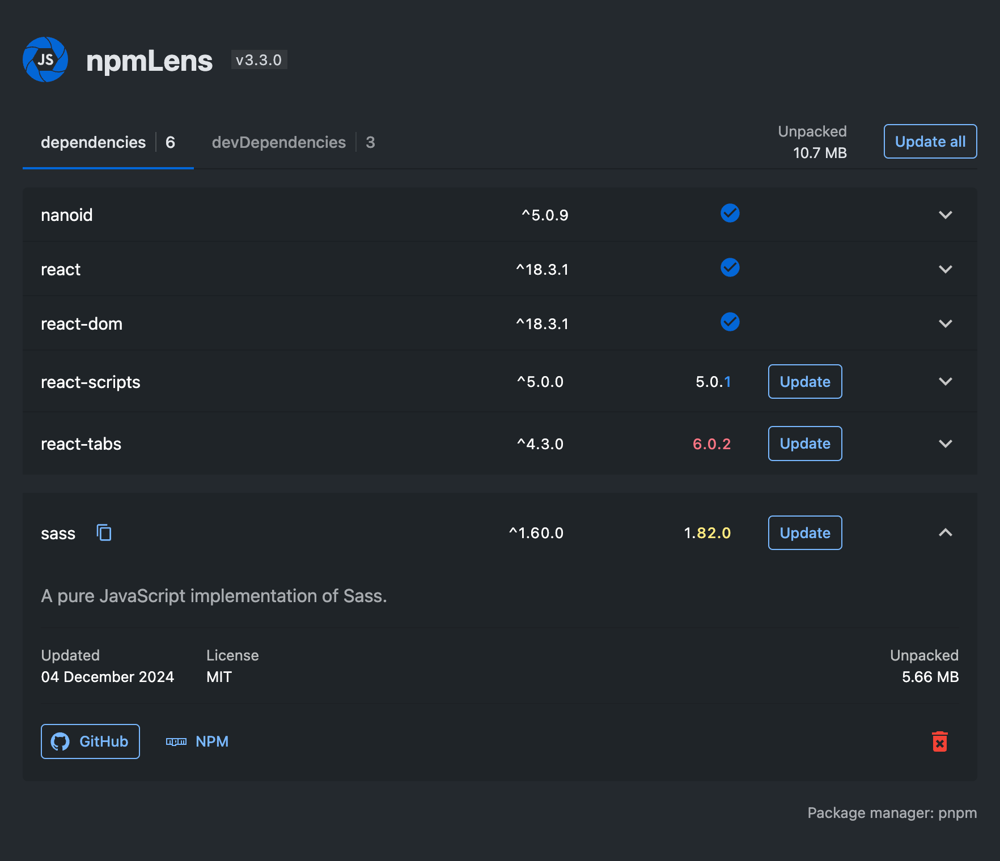

# npmLens

Simple and clear visual panel for npm dependencies of your project: Monitor Updates, Analyze Size, and More.

## Features

- A visualized list of your dependencies and their versions.
- Checking for new available versions of your dependencies.
- Easy update and removal of dependencies.
- Displays basic information about a package.
- Calculates the total size of your project.
- Adapts to VS Code theme.

## Usage

To activate the extension, click on the new icon added to your `activitybar`.  
❕`package.json` must be present in your workspace.

## Example

