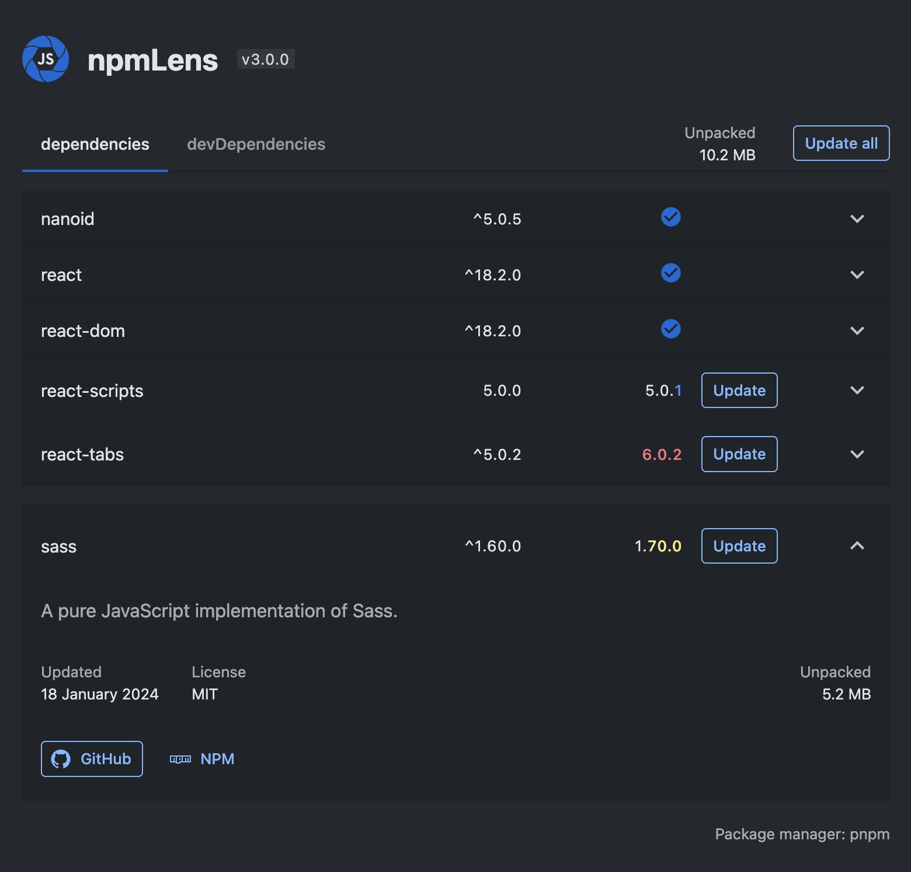

# 🥷 npmLens

Simple and clear visual panel for npm dependencies of your project: Monitor Updates, Analyze Size, and More.

## Features

- A visualized list of your dependencies and their versions.
- Checking for new available versions of your dependencies.
- Displays basic information about a package.
- Calculates the size of each package.
- Calculates the number of dependencies of this package.
- Calculates the total size of your project.
- Adapts to VS Code theme.

## Usage

To activate the extension, click on the new icon added to your `activitybar`.  
❕`package.json` must be present in your workspace.

 

Example 1

 
 

Example 2

1. The total size of your project's dependencies (for the active tab).
2. How many dependencies your chosen package depends on (fewer is better)

## Providers

1. NPM
2. Bundlephobia || BundleJS. <i>(Currently completely disabled due to their unstable operation.)</i>

## Telemetry

No trackers! 🍺
